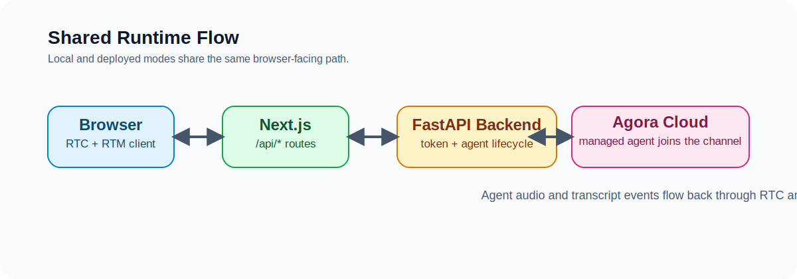

# Agora Conversational AI Web Demo

Real-time voice conversation with AI agents, featuring the Agora UIKit transcript experience with two supported runtime modes:

- local Python-backed development
- single-target web deployment

## Architecture

<picture>
  <source media="(prefers-color-scheme: dark)" srcset="./.github/images/system-architecture-dark.svg">
  
</picture>

## Prerequisites

- [Node.js](https://nodejs.org/) 20+ with npm, or [Bun](https://bun.sh/)
- Python 3.8+
- [Agora CLI](https://www.npmjs.com/package/agoraio-cli)
- [Agora Account](https://console.agora.io/) with App ID & App Certificate
- Agora project with Conversational AI managed provider support enabled

## Quick Start

### Local Python-Backed Development

```bash
# 1. Install dependencies
bun install
# or
npm install

# 2. Login and connect the demo to Agora
agora login
agora project create my-first-voice-agent --feature rtc --feature convoai
agora project use my-first-voice-agent
agora project env write server/.env.local --with-secrets

# 3. Start services
bun run dev
# or
npm run dev
```

`server/.env.example` remains the reference for the variables this demo uses. The recommended path is to let the Agora CLI write the real values into `server/.env.local`.

Install dependencies from the repo root. The workspace supports either Bun or npm.

Services will be available at:
- Frontend: http://localhost:3000
- Backend: http://localhost:8000
- API Docs: http://localhost:8000/docs

In local development, the browser still calls `/api/*` on the Next app. Those route handlers proxy to the FastAPI backend through `AGENT_BACKEND_URL=http://localhost:8000`, which the root scripts set automatically.

### Single-Target Web Deployment

Deploy `web` as a Next.js app. In this mode, the Next route handlers serve these endpoints directly:

- `/api/get_config`
- `/api/v2/startAgent`
- `/api/v2/stopAgent`

Set these env vars in the deployment target:

```bash
AGORA_APP_ID=your_agora_app_id
AGORA_APP_CERTIFICATE=your_agora_app_certificate
AGENT_GREETING=optional_custom_greeting
```

Do not set `AGENT_BACKEND_URL` in deployment unless you intentionally want the web app to proxy to an external Python service.

## Configuration

Recommended:

```bash
agora project env write server/.env.local --with-secrets
```

Reference template:

```bash
# Agora Credentials (required)
AGORA_APP_ID=your_agora_app_id
AGORA_APP_CERTIFICATE=your_agora_app_certificate

PORT=8000
```

Authentication uses Token007 (AccessToken2), generated automatically from `AGORA_APP_ID` and `AGORA_APP_CERTIFICATE`. Vendor credentials are no longer required in local setup; the backend defaults to the same DeepgramSTT + OpenAI + MiniMaxTTS managed configuration used by the current Next.js quickstart.

Frontend deployment env vars live in the deployment target or `web/.env.local` when running the web app by itself. The browser does not need its own public Agora credentials in this sample.

## Commands

```bash
bun run dev | npm run dev
bun run doctor | npm run doctor
bun run doctor:local | npm run doctor:local
bun run backend | npm run backend
bun run frontend | npm run frontend
bun run build | npm run build
bun run verify | npm run verify
bun run verify:local | npm run verify:local
bun run verify:web | npm run verify:web
bun run verify:local:fastapi | npm run verify:local:fastapi
bun run verify:backend | npm run verify:backend
bun run clean | npm run clean
```

## Project Structure

```
.
├── web/       # Frontend — Next.js 16 + React 19 + TypeScript + Agora Web SDK
├── server/    # Backend — Python FastAPI + Agora Agent SDK
├── ARCHITECTURE.md   # System architecture and data flow
└── AGENTS.md         # AI agent development guide
```

## Troubleshooting

| Problem | Check |
|---------|-------|
| Connection issues | Backend running on port 8000? |
| Agora credentials not written yet | Run `agora project use my-first-voice-agent` and `agora project env write server/.env.local --with-secrets` |
| Auth errors | `AGORA_APP_ID` and `AGORA_APP_CERTIFICATE` correct in `.env.local`? |
| Agent fails to start | Confirm Agora managed provider access is enabled for this project, then check logs at http://localhost:8000/docs |
| Frontend can't reach backend | If running local Python mode, confirm `AGENT_BACKEND_URL=http://localhost:8000` is set via the root frontend scripts |
| Dependencies did not update the web app | Run `bun install` or `npm install` from the repo root so the workspace dependencies stay aligned |
| Deployed web app returns API auth errors | Confirm `AGORA_APP_ID` and `AGORA_APP_CERTIFICATE` are set in the deployment target and `AGENT_BACKEND_URL` is not pointing to localhost |
| Unsure which service owns `/api/*` | Local dev: Next route handlers proxy to FastAPI. Deployment: Next route handlers handle requests directly unless `AGENT_BACKEND_URL` is set |

## Verification

Run the mode-appropriate command from the repo root after changes:

```bash
bun run verify:web
bun run verify:local
# or
npm run verify:web
npm run verify:local
```

When working inside `web` as a standalone deployable app:

```bash
cd web
bun run doctor
bun run verify
# or
npm run doctor
npm run verify
```

Useful narrower checks:

```bash
bun run doctor
bun run doctor:local
bun run verify:web
bun run verify:local:fastapi
bun run verify:web:proxy
bun run verify:backend
# or
npm run doctor
npm run doctor:local
npm run verify:web
npm run verify:local:fastapi
npm run verify:web:proxy
npm run verify:backend
```

## Documentation

- [ARCHITECTURE.md](./ARCHITECTURE.md) — System architecture and data flow
- [AGENTS.md](./AGENTS.md) — AI agent development guide
- [web/](./web/) — Frontend details
- [server/](./server/) — Backend details

## License

See [LICENSE](./LICENSE).
