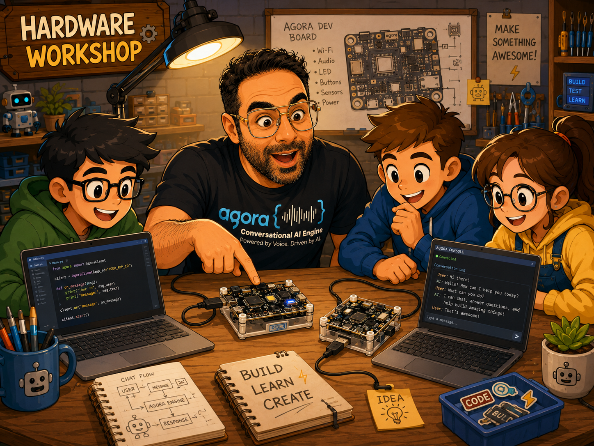
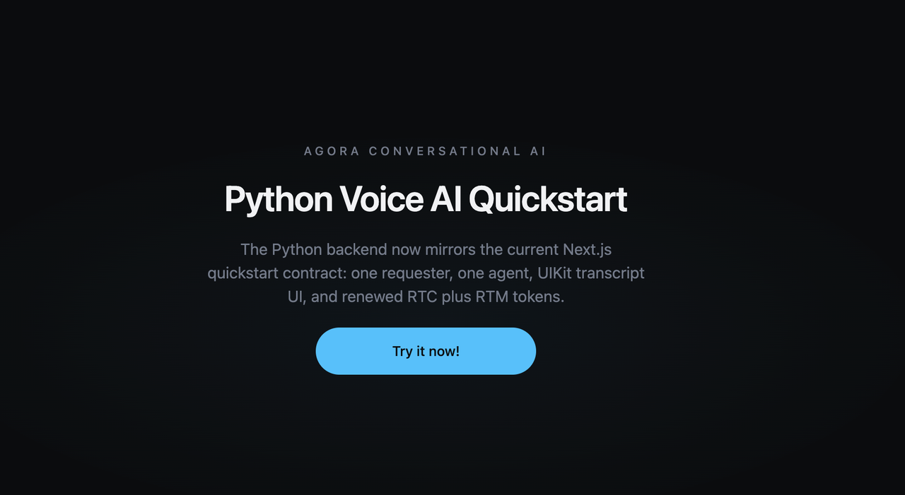
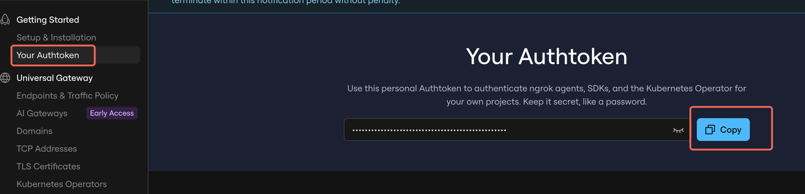
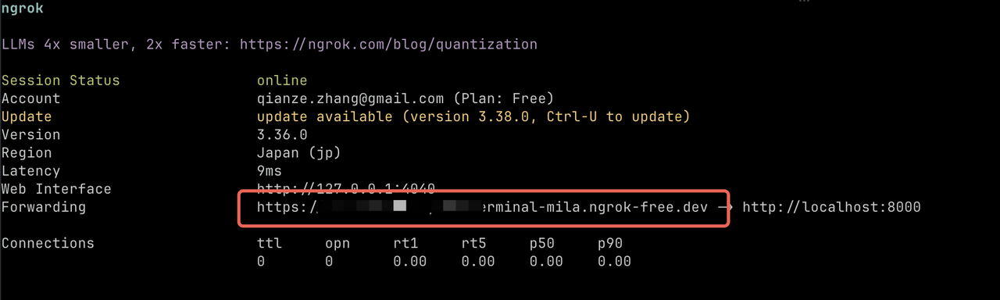
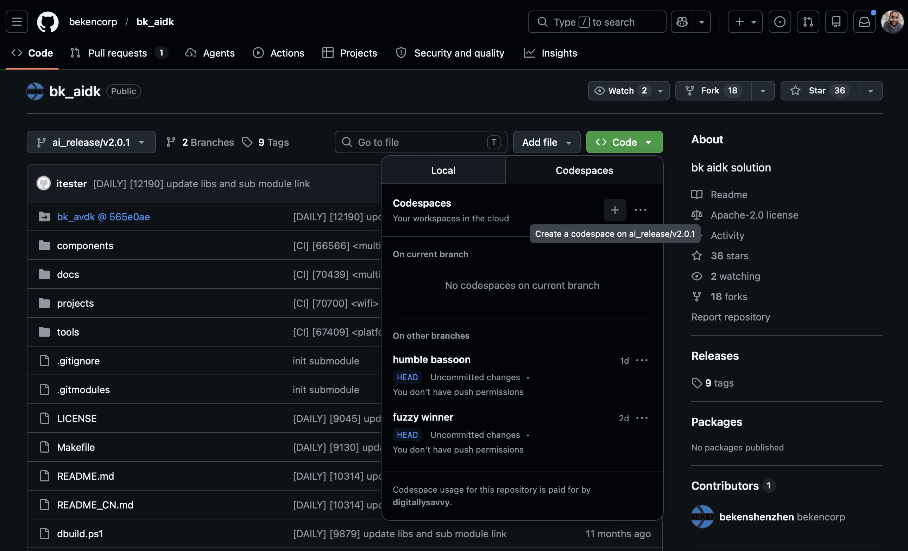
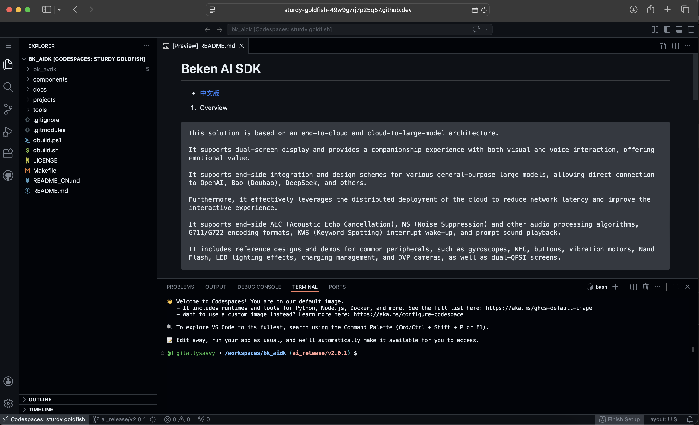
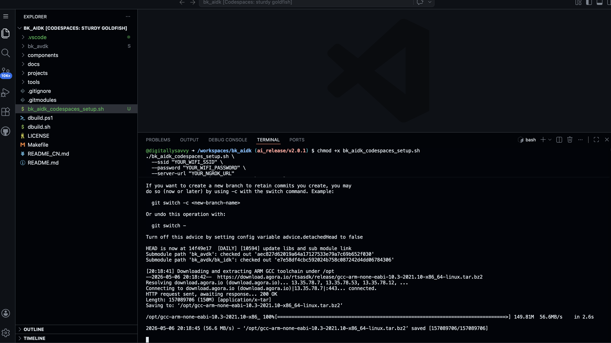
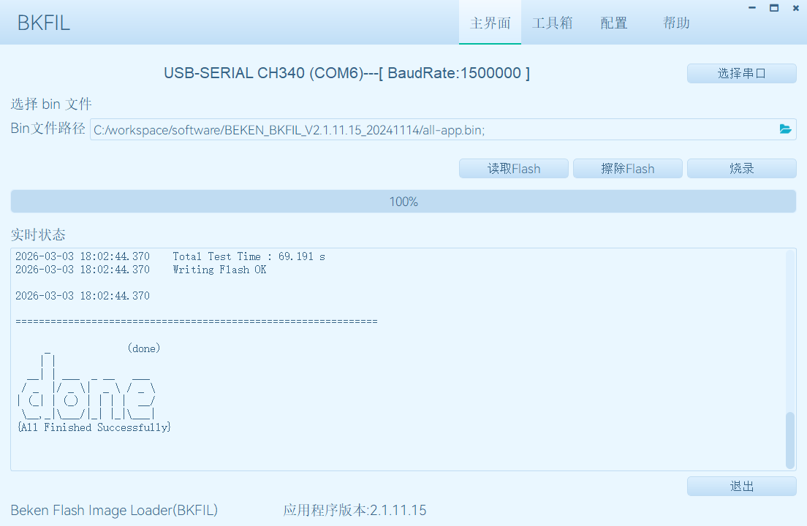
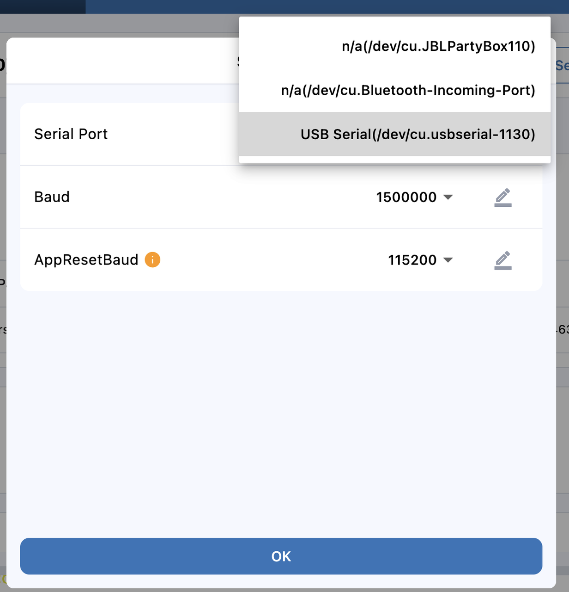
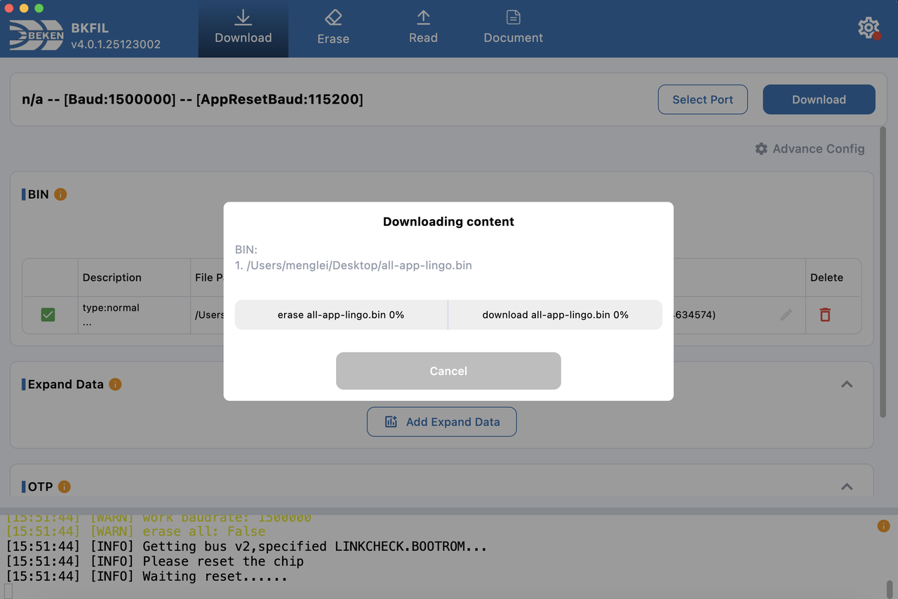

# Agora Conversational AI + BK7258 Workshop

Build a voice-first AI companion you can talk to in real time, then bring it onto R1 hardware. In this workshop, you will use Agora Skills, a Python-backed quickstart, ngrok, and the BK7258 development kit to go from local Voice Agent to hardware-powered conversation.



## What You Will Build

By the end of this workshop, your BK7258-based hardware will connect to the Agora Conversational AI stack, and you will have a working real-time voice experience backed by this repository.

This workshop is split into two challenges:

- **[Challenge 1](#1-challenge-1-build-and-run-the-voice-agent):** use Vibe Coding + Agora Skills to build and run your first Voice Agent.
- **[Challenge 2](#4-challenge-2-connect-the-r1-hardware):** connect the R1 hardware to the Voice Agent you built.

Before you start:
- Bring a GitHub account so you can create a Codespaces environment.
- Install or prepare your AI coding tool before the workshop starts.
- Make sure the hardware can connect to the on-site **2.4G Wi-Fi** network. The R1 hardware requires 2.4G Wi-Fi.

---

## 1) Challenge 1: Build and Run the Voice Agent

### Install Agora Skills and CLI

Run these commands on your local machine after Node.js is installed. Install the Agora Skills so your AI coding tool has the Agora product context needed for the workshop:

```bash
npx skills add github:AgoraIO/skills
```

GitHub: [Agora Skills](https://github.com/AgoraIO/skills)

Install the Agora CLI:

```bash
curl -fsSL https://raw.githubusercontent.com/AgoraIO/cli/main/install.sh | sh
agora --version
```

GitHub: [Agora CLI package](https://www.npmjs.com/package/agoraio-cli)

After the skills are installed, use your AI coding tool to help inspect and modify this quickstart. For example, ask it to explain the request flow, trace where `/api/*` routes are handled, or help customize the agent greeting.

---

## 2) Clone and Run the Local Repo

Clone this workshop repository and check out the workshop branch:

```bash
git clone https://github.com/AgoraIO-Conversational-AI/agent-quickstart-python.git
cd agent-quickstart-python
git checkout r1-workshop
```

Install dependencies with either Bun or npm:

```bash
bun install
# or
npm install
```

Connect the repo to your Agora project:

```bash
agora login
agora project create my-first-voice-agent --feature rtc --feature convoai
agora project use my-first-voice-agent
agora project env write server/.env.local --with-secrets
```

Run the local quickstart:

```bash
bun run dev
# or
npm run dev
```

Endpoints:
- web: `http://localhost:3000`
- local backend: `http://localhost:8000`

Checkpoint before continuing:
- Open `http://localhost:3000` and confirm the app loads.
- Open `http://localhost:3000/api/get_config` and confirm it returns JSON.
- Keep this terminal running. You will start ngrok in a second terminal in the next step.

Open the web app and start a conversation session.

UI reference:



Useful references:
- [Agora Conversational AI docs](https://docs.agora.io/en/conversational-ai/overview/product-overview)
- [Agora Token auth overview](https://docs.agora.io/en/3.x/video-calling/basic-features/token-server)

---

## 3) Configure ngrok URLs

After the quickstart is running locally, use ngrok for two separate jobs:

- Share the **web demo** by exposing the local Next app on port `3000`.
- Connect the **R1 device** by exposing the local Python backend on port `8000`.

Keep the URLs separate. The frontend URL is for humans opening the demo in a browser. The backend URL is the `--server-url` value you will compile into the R1 firmware.

Get your ngrok auth token first:



In a second terminal, authenticate ngrok:

```bash
ngrok config add-authtoken <YOUR_AUTH_TOKEN>
```

### Share the Web Demo

Use this when you want someone else to open the browser UI:

```bash
ngrok http 3000
```

Copy the HTTPS forwarding URL and treat it as `YOUR_FRONTEND_NGROK_URL`:



### Expose the Backend for R1

Use this for the hardware device protocol:

```bash
ngrok http 8000
```

Copy this HTTPS forwarding URL and treat it as `YOUR_BACKEND_NGROK_URL`. This is the value to pass as `--server-url` later.

Checkpoint before continuing:
- Open `YOUR_FRONTEND_NGROK_URL` in your browser and confirm it loads the same app as `http://localhost:3000`.
- Open `YOUR_BACKEND_NGROK_URL/get_config` and confirm it returns JSON for the IoT device protocol.
- Use `YOUR_BACKEND_NGROK_URL` later in the firmware setup.
- Do not use `localhost`, `http://localhost:3000`, or `YOUR_FRONTEND_NGROK_URL` as the firmware server URL.

---

## 4) Challenge 2: Connect the R1 Hardware

The R1 development kit integrates the Agora Conversational AI flow with BK7258 hardware. It supports voice interaction through microphone/speaker hardware and includes development interfaces for flashing, debugging, and extension.

Use the board map below to identify USB/UART, mic, speaker, button, reset, and power-related interfaces before you connect and flash:


### Product Overview

The BK AIDK `beken_genie` reference project includes:
- microphone and speaker support
- Wi-Fi Station mode
- BLE / BT PAN support
- AEC and NS audio processing
- G711 / G722 audio codec support
- reference peripherals such as NFC, gyroscope, battery management, LED, buttons, vibration motor, SD NAND, DVP camera, and dual SPI LCD

Reference: [Beken AIDK `beken_genie` docs](https://docs.bekencorp.com/arminodoc/bk_aidk/bk7258/en/v2.0.1/projects/beken_genie/index.html)

### Button Functions and Layout

Use the board diagram to locate:
- USB-to-UART interface for flashing/debugging
- speaker and microphone ports for voice I/O
- reset button for boot/flash recovery
- side buttons for user input during demos
- USB-C/power and battery connector paths
- UART expansion pins for debugging or extension

During flashing, keep the reset button accessible. If the flash tool waits for reset, press the reset button once and continue.

---

## 5) Get Workshop Firmware/Code Workspace Ready

Download/open the original factory development environment for the BK hardware:

1. Open the BK AIDK repository: [bekencorp/bk_aidk](https://github.com/bekencorp/bk_aidk).
2. Confirm the current branch is `ai_release/v2.0.1`.
3. Click `+` or `Code` -> `Codespaces` on the GitHub page.
4. Create a Codespaces environment from the `ai_release/v2.0.1` branch.

Note: if older workshop material mentions `ai_server/v2.0.1`, use `ai_release/v2.0.1` for the public GitHub repository.

References:
- GitHub Codespaces: [overview](https://docs.github.com/en/codespaces/overview), [create a codespace](https://docs.github.com/en/codespaces/developing-in-a-codespace/creating-a-codespace)
- BK AIDK branch docs: [English README](https://github.com/bekencorp/bk_aidk/tree/ai_release/v2.0.1)



Example editor/workspace view:



After the Codespace opens:

5. Add [`bk_aidk_codespaces_setup.sh`](./.github/workshop/bk_aidk_codespaces_setup.sh) to the **root of the `bk_aidk` workspace** (the same folder as the repo root in Codespaces, usually `/workspaces/bk_aidk/`).

   You can drag the file from your machine into the file explorer, or download it directly inside Codespaces after this workshop branch is pushed. The terminal should already be in the `bk_aidk` repo root:

   ```bash
   curl -fL -o bk_aidk_codespaces_setup.sh \
     https://raw.githubusercontent.com/AgoraIO-Conversational-AI/agent-quickstart-python/r1-workshop/.github/workshop/bk_aidk_codespaces_setup.sh
   ```

6. In the Codespaces terminal, make the script executable and run it. For **Agent service address**, pass the **`--server-url`** value: use `YOUR_BACKEND_NGROK_URL` from [step 3](#3-configure-ngrok-urls) (no trailing slash unless your firmware expects it). Use the on-site **2.4G Wi-Fi** SSID and password where prompted.

   ```bash
   chmod +x bk_aidk_codespaces_setup.sh
   ./bk_aidk_codespaces_setup.sh \
     --ssid "YOUR_WIFI_SSID" \
     --password "YOUR_WIFI_PASSWORD" \
     --server-url "YOUR_BACKEND_NGROK_URL"
   ```

   Replace `YOUR_WIFI_*` with the workshop Wi-Fi credentials. Replace `YOUR_BACKEND_NGROK_URL` with the full public HTTPS forwarding URL from `ngrok http 8000`, for example `https://abc123.ngrok-free.app`.

   Do not commit Wi-Fi credentials, generated config, or firmware-specific secrets back to GitHub.

Compile the firmware from the Codespaces terminal with the workshop build snippet. Paste this whole block as-is:

```bash
# Install missing Python packages.
pip install click future click_option_group cryptography pycryptodome

# Point the build to the Codespaces Python runtime.
export PYTHON=/home/codespace/.python/current/bin/python
export PATH=/home/codespace/.python/current/bin:$PATH
export ARMINO_PATH=/workspaces/bk_aidk/bk_avdk/bk_idk
export PYTHON_EXECUTABLE=$PYTHON

unset PYTHONNOUSERSITE
$PYTHON -m pip install --user --force-reinstall "setuptools==80.9.0"

# Confirm the Python runtime and package path before compiling.
$PYTHON - <<'PY'
import sys
print(sys.executable)
print(sys.version)
import pkg_resources
print(pkg_resources.__file__)
PY

# Compile.
make bk7258 PROJECT=beken_genie
```

Typical firmware builds will show logs like:



When the build finishes, locate the generated firmware artifact. The expected output is an `all-app.bin` file under the `build/beken_genie/bk7258` output tree. Use that file for flashing unless the workshop host provides a prebuilt firmware binary.

Use this helper command if you need to find it:

```bash
python3 - <<'PY'
from pathlib import Path
for path in Path("build/beken_genie").rglob("all-app.bin"):
    print(path)
PY
```

Reference: [Beken firmware flashing docs](https://docs.bekencorp.com/arminodoc/bk_idk/bk7258/en/v_ai_2.0.1/get-started/index.html#burn-code)

---

## 6) Flash Firmware to the Board

You can use either desktop BKFIL or the web flashing flow. For macOS, download BKFIL here: [BKFIL macOS 4.0.1.25123002](https://agora-packages.s3.us-west-2.amazonaws.com/BKFIL_macos_4.0.1.25123002.zip). If the workshop host provides a different BKFIL download or web flashing URL, use that version.

### Option A: Desktop BKFIL

1. Connect board over USB.
2. Choose the correct serial port.
3. Select your generated `all-app.bin` (or workshop-provided) firmware.
4. Set baudrate (commonly `1500000`).
5. Start flashing.
6. If prompted, press reset on the board.
7. Wait for the success message before unplugging or rebooting the device.

Reference screenshot:



### Option B: Web BKFIL

1. Open BKFIL web UI.
2. Select serial port from dropdown.
3. Confirm baud settings (`1500000`, `AppResetBaud 115200` where required).
4. Select the generated `all-app.bin` file.
5. Start download/flash.
6. Reset chip if prompted.
7. Wait for the erase/download progress to complete.

References:




---

## 7) Validation Checklist

Confirm all items below:

- local services start without backend/credential errors
- `http://localhost:3000` loads the web app
- `http://localhost:3000/api/get_config` returns JSON
- frontend ngrok tunnel is online and its HTTPS URL loads the web app
- backend ngrok tunnel is online and `YOUR_BACKEND_NGROK_URL/get_config` returns JSON
- `bk_aidk_codespaces_setup.sh` was run with the workshop Wi-Fi and `YOUR_BACKEND_NGROK_URL`
- firmware build completes and produces `all-app.bin`
- board is detected on a valid serial port
- flash process completes successfully
- microphone input is captured and agent audio returns
- transcript/voice interaction works in the web UI

---

## Troubleshooting

- **No serial device shown**: reconnect USB, close apps that lock serial ports, retry BK tool.
- **Flash hangs at reset/check**: manually press reset button on the board and retry.
- **No frontend tunnel URL**: verify ngrok auth token and restart `ngrok http 3000`.
- **No backend tunnel URL**: verify ngrok auth token and restart `ngrok http 8000`.
- **Agent does not start**: verify Agora project env is written to `server/.env.local`.
- **Web cannot reach backend**: ensure local backend is up and port `8000` is free.

---

## Useful Commands

```bash
# full local stack
bun run dev
# or
npm run dev

# health checks
bun run doctor
bun run doctor:local
# or
npm run doctor
npm run doctor:local

# verification
bun run verify
bun run verify:local
bun run verify:web
# or
npm run verify
npm run verify:local
npm run verify:web
```

## Workshop Source Reference

- Original workshop page: [Hardware Process: R1 + Skill Practical Operation](https://rcnxnwjad4la.feishu.cn/wiki/B9D0w1Q1XiEZyNkdHm6cKY4nnNd)
